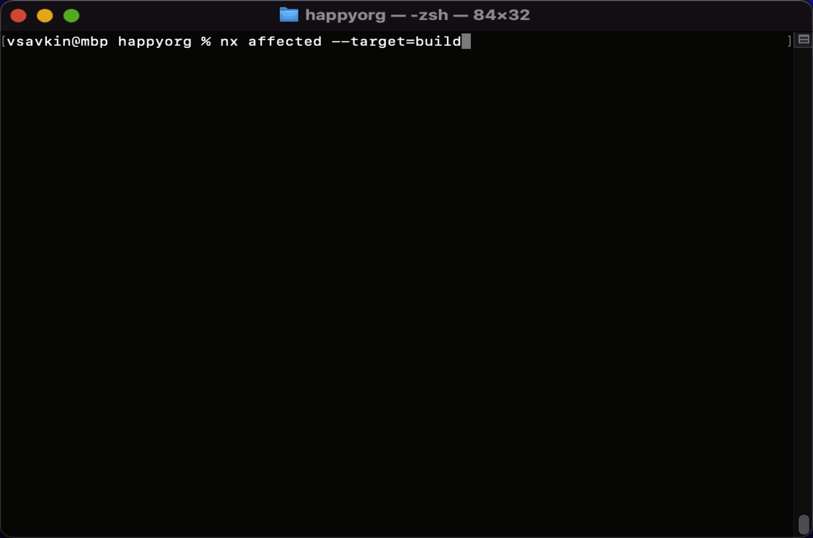
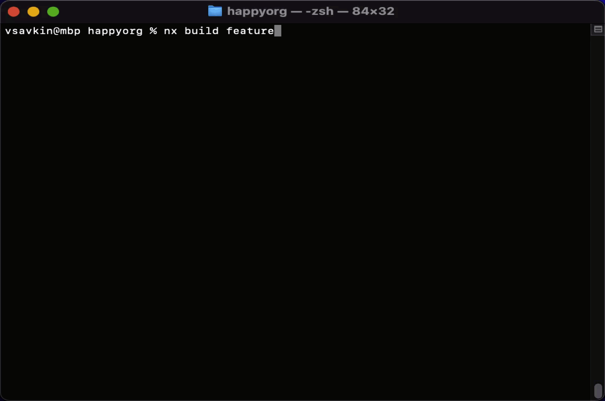
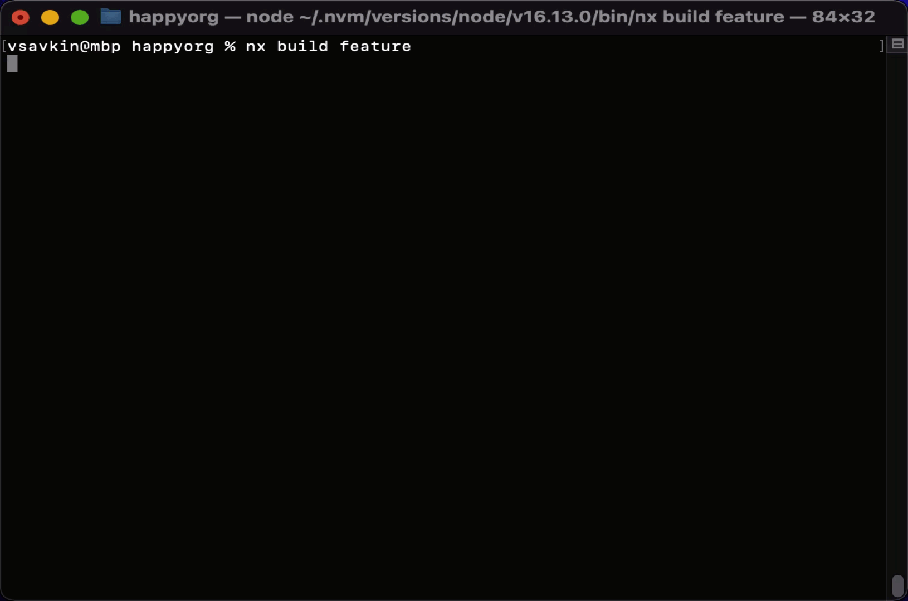
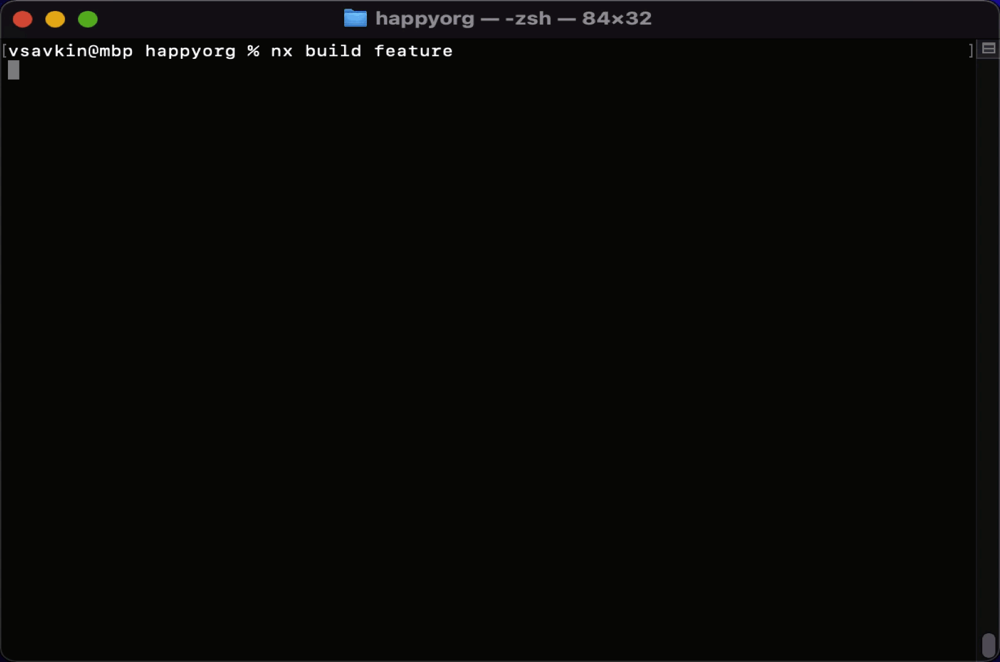

# Nx and Dev Ergonomics

[This benchmark](https://github.com/vsavkin/large-monorepo) showed that Nx is faster than Turborepo for non-trivial workspaces. **Where Nx really shines though is DX and extensibility.** I won’t compare Nx and Turborepo side by side here cause DX is more subjective. I’ll show you how Nx works, and you can make up your mind.

This is a repo with two buildable ts packages: `utils` and `feature`. You have to build `utils` before you build `feature`.

I could run: `nx affected —target=build` which would rebuild everything affected by my code change, and it will show the logs for everything being rebuilt/restored from cache.

Commands like `nx affected` are used in CI, but aren’t used as much locally. Locally, 99 times out of 100, you only rebuild one thing (cause you’re working on that one thing).

`nx build feature` is a shorter command (commands you type frequently are short in Nx). It builds `feature` and all its deps (in the right order and in parallel). But it will only show the outputs for `feature`’s deps if they change. If `utils` stays the same, no point showing me that it’s rebuilt. I’m working on `feature`, not `utils`.

You could think of running `nx build feature` as running a build pipeline, but I don’t think this is the best way to think about it. A better way to think about it is in terms of “preconditions”. To build `feature`, you have to have the results of building the current version of `utils` in the right `dist` folder.

That’s what Nx does when it works through its task graph. Are the right files in the right folder? Yes => do nothing. No => do we have the cached version of them? Yes => restore them. No => run `nx build utils`. Only in the last case you will see anything regarding `utils` in the terminal output. Cause only in this case something can go wrong.

Finally, Nx captures output as is: animations, colours are all captured and restored. So invoking an npm script directly or via Nx will always look the same (of course the latter version can be a lot faster :) )

Given these two points, when using Nx, you never run npm scripts without Nx. Why would you? Some preconditions may not be met, so you are only inviting trouble.

This is just one example of attending to DX, but there are many others.
